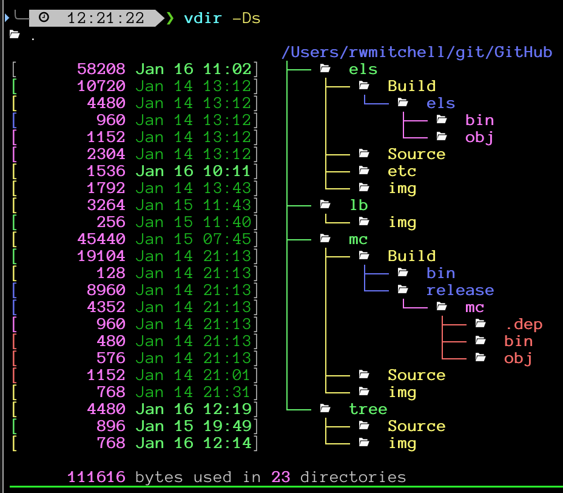

# tree
## Background
This is a fork of:   ftp://mama.indstate.edu/linux/tree/

I've customized it for features I wanted.  The original code has also continued to evolve.  I recommend looking there first.

- add color to the level indicator lines
  - uses $TREE_COLORS defines colors
- add glyphs to filenames/directories
  - uses $LS_ICONS

## Requirements
- OS X and C
- $LS_ICONS - this is from my els repo

# tree
## Background
This is a fork of:   ftp://mama.indstate.edu/linux/tree/

I've customized it for features I wanted.  The original code has also continued to evolve.  I recommend looking there first.

- add color to the level indicator lines
  - uses $TREE_COLORS defines colors
- add glyphs to filenames/directories
  - uses $LS_ICONS

## Requirements
- OS X and C
- $LS_ICONS - this is from my els repo

## Screenshots

